# AssetFlow 전체 흐름

코드에 실제로 있는 경로만 그린다. 설계 의도나 계획은 넣지 않는다.

근거: `app/routers/`, `app/services/graph.py`, `app/services/nodes.py`, `app/services/execution.py`

---

## 1. 전체 경로 — 요청문 한 줄에서 지급 처리까지

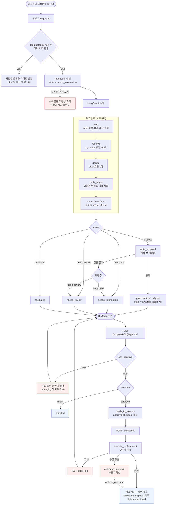

---

## 2. 요청 상태 기계

`request.state` ENUM 8개가 전부다. 다른 값으로는 갈 수 없다.

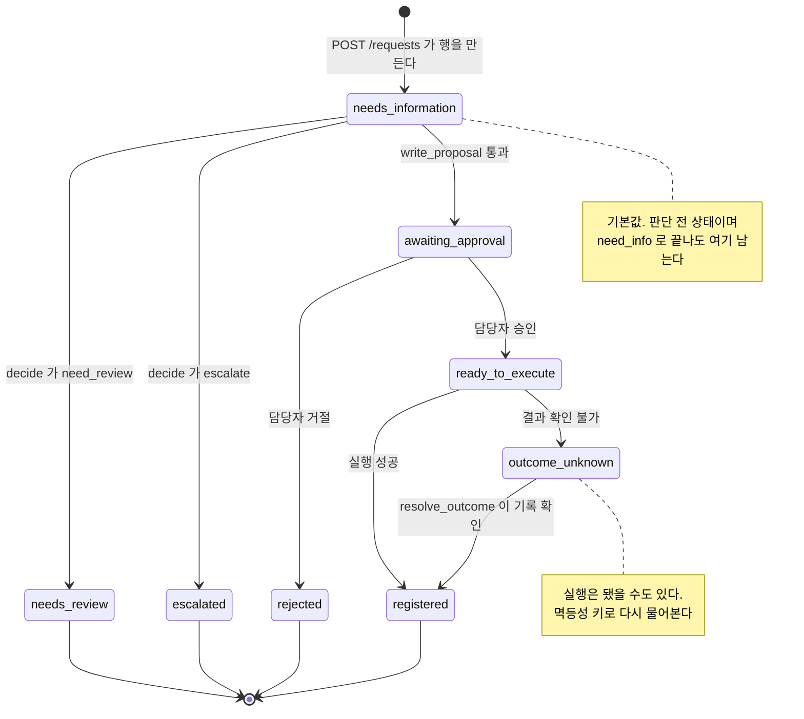

**`needs_information` 이 시작값이자 종착값**이다. 요청은 사람이 말을 건 순간 만들어지고, 판단 결과가 그 행의 속성으로 붙는다(단계 102).

---

## 3. 시나리오별 타임라인

### AR-01 정상 교체 — `propose` → `registered`

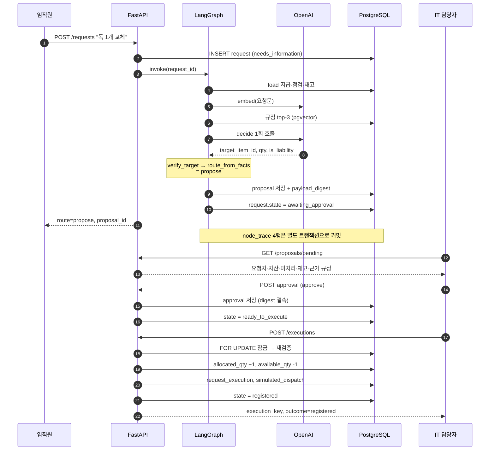

### AR-03 점검 미완 — `need_review`

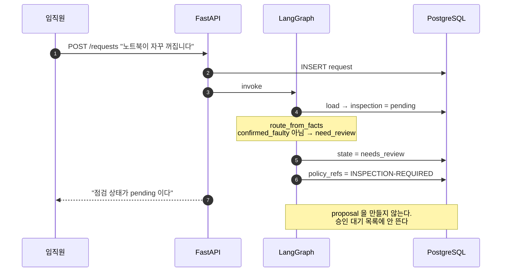

### 대상 불명 — `need_info`

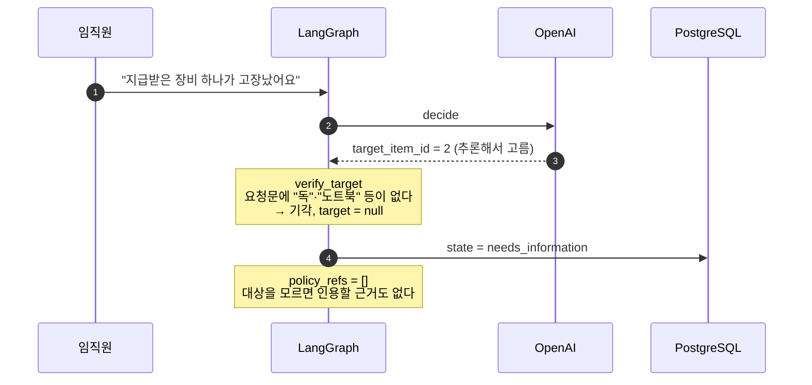

### 귀책·비용 — `escalate`

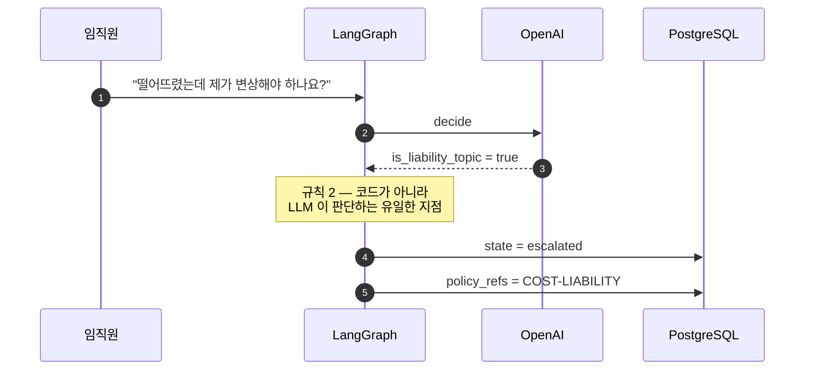

---

## 4. 반복되는 루프 네 가지

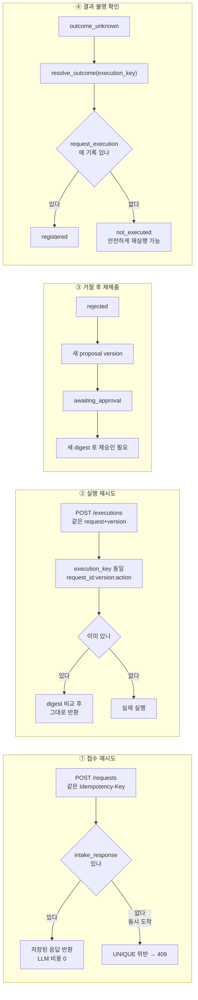

③은 `proposal.version` 과 `payload_digest` 가 있어 성립한다. 처리안이 바뀌면 digest 가 달라지고, 옛 승인은 실행 단계에서 거부된다.

---

## 5. 실행 트랜잭션 — 검증 9단계

`execute_replacement` 는 이 순서를 지킨다. **순서가 전부다.**

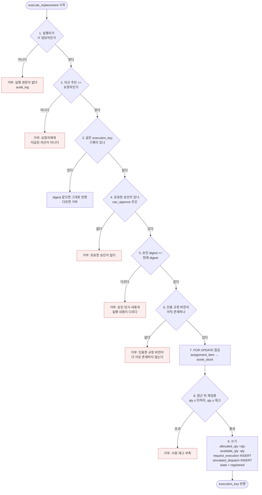

**잠금 순서가 고정이다** — `assignment_item` 다음 `asset_stock`. 뒤집으면 교착이 생긴다.

**잠근 뒤에 읽고 판단한다.** 잠그기 전 값으로 판정하면 잠금이 무의미하다(단계 32·33).

**함수가 커밋하지 않는다.** 트랜잭션 경계는 `get_conn` 이 정한다. 그래서 재고 차감·실행 기록·상태 갱신이 전부 되거나 전부 안 된다.

---

## 6. 두 개의 트랜잭션

관측이 업무와 분리돼 있다. 이 구조가 여러 곳에서 결과를 바꾼다.

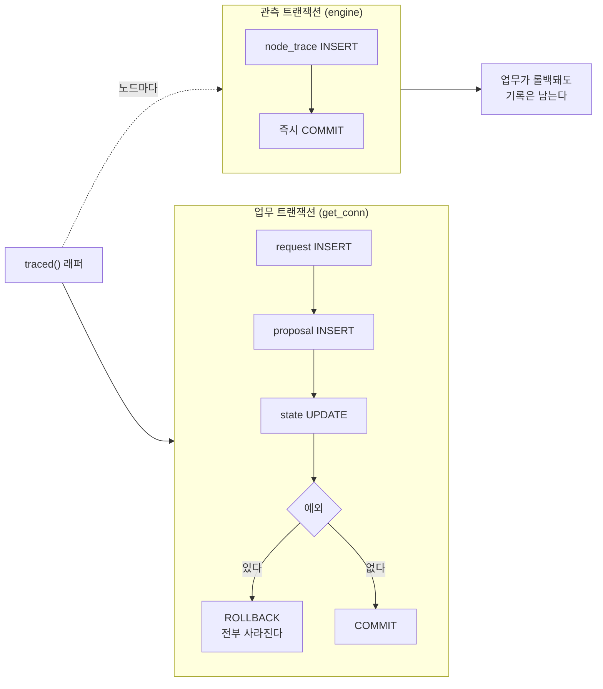

| 얻은 것 | 치른 값 |
|---|---|
| 실패해도 "무엇을 시도했는지" 남는다 | `node_trace.request_id` 의 외래키를 끊어야 했다 |
| 평가 하니스가 롤백해도 비용·지연은 측정된다 | 시드 초기화 후 `request.id` 재사용으로 옛 기록이 섞인다 |

두 번째 대가가 실제로 청구됐다 — `request_id = 1` 에 서로 다른 실행이 7개 붙었고, 조회 쿼리에 `ORDER BY` 가 없어 아무거나 골라 화면에 띄웠다(단계 86·88).

---

## 7. API 7개와 화면

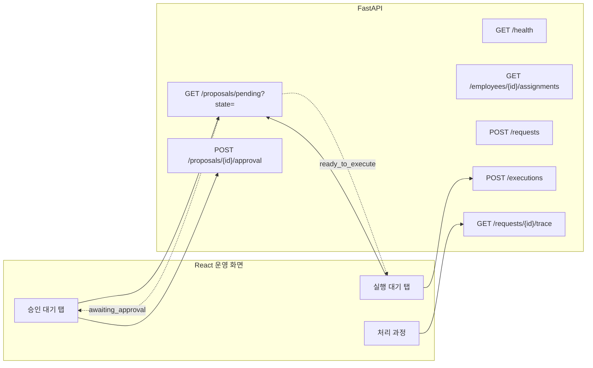

`POST /executions` 의 본문은 `request_id` 와 `proposal_version` 뿐이다. **무엇을 몇 개 처리할지는 승인된 처리안에서 서버가 읽는다.** 화면은 "실행해라"만 말할 수 있고 "무엇을 몇 개"는 말할 수 없다(단계 84).

---

## 8. LLM 이 관여하는 지점

전체에서 LLM 호출은 **요청당 2회**다. 임베딩 1회, 판단 1회.

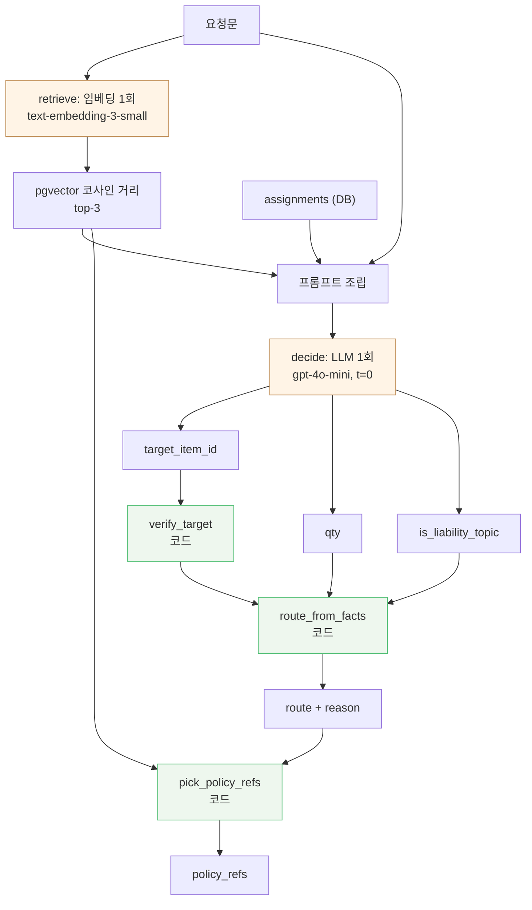

**LLM 출력 3개는 전부 코드 검증을 거친다.** 경로 이름도 근거 규정도 모델이 고르지 않는다.

| 누가 정하나 | 무엇 |
|---|---|
| LLM | 어떤 자산 · 몇 개 · 귀책 주제인가 |
| 코드 | 경로 · 설명 문구 · 인용 규정 · 수량 가능 여부 · 권한 |
| DB | 최종 거부 (CHECK · UNIQUE · FK · 행 잠금) |
