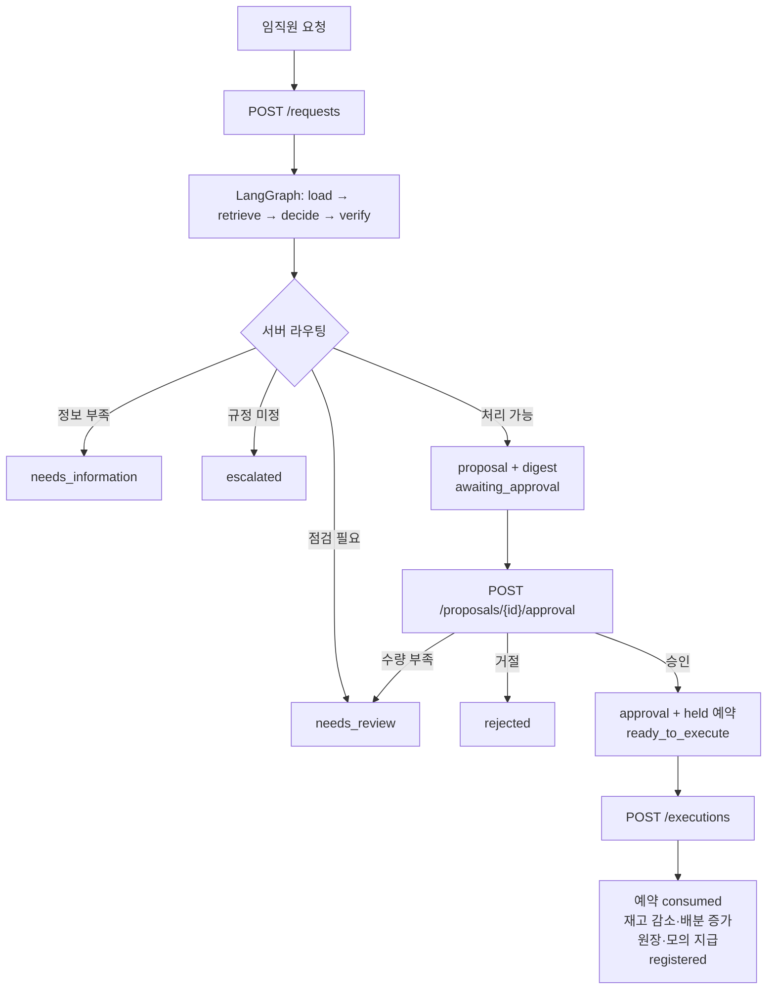
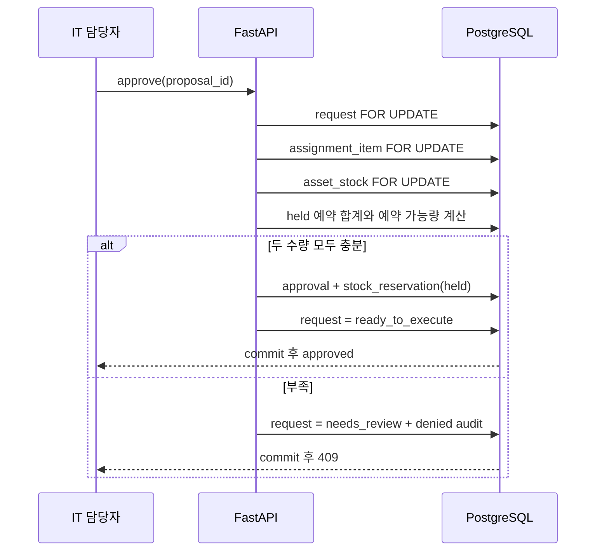
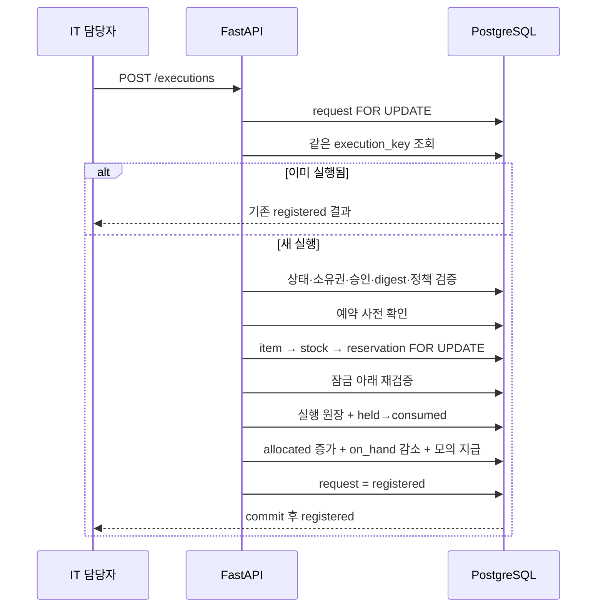
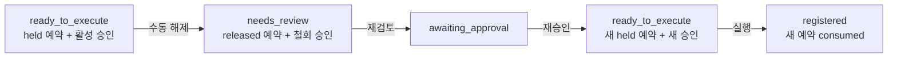

# AssetFlow 현재 업무 흐름

코드에 구현된 경로만 기록한다. 근거는 `app/routers`, `app/services`와
[ADR-002](adr/002-stock-reservation.md)다.

## 요청부터 실행까지



LLM은 대상 자산·수량·귀책 주제를 추출한다. 경로, 권한, 인용 확정, 수량 계산,
예약과 실행은 코드와 DB가 결정한다.

## 승인·예약



승인은 `on_hand_qty`나 `allocated_qty`를 바꾸지 않는다. 수량을 약속하는 `held` 행만
만든다.

## 실행



## 해제·재검토·재승인



- 해제: `POST /proposals/{id}/release`, 사유 필수, `consumed` 예약 해제 금지.
- 재검토: `POST /proposals/{id}/re-review`, 실행 기록·활성 승인·`held` 예약이 없어야 한다.
- 과거 승인과 예약은 삭제하지 않고 철회·해제 이력으로 남는다.

## 결과 확인

성공 응답은 commit 이후 전송된다. 응답만 유실되면 같은 실행 요청은 기존 결과를
반환한다. 별도 확인은 다음 API를 사용한다.

```text
GET /executions/status?request_id={id}&proposal_version={version}
```

DB 연결 자체가 불가능한 동안에는 503과 일시적인 `outcome: unknown`을 반환할 수 있으나
DB 상태를 추측해 쓰지 않는다. 연결 복구 후 실행 원장으로 `registered` 또는
`not_executed`를 확정한다.

## 운영 화면

승인 관리 화면은 `awaiting_approval`, `ready_to_execute`, `needs_review` 세 탭을 제공한다.
각 처리안에서 보유량, `held` 예약 합계, 새 승인 가능량과 현재 예약 상태를 구분해
표시한다. 실행 대기 탭에서 예약을 해제하고 재검토 탭에서 승인 대기로 되돌릴 수 있다.

## 현재 한계

- 새 처리안 버전을 작성하는 UI/API는 없다.
- 예약 자동 만료는 없다.
- 지급은 내부 `simulated_dispatch` 기록이며 외부 시스템 호출이 아니다.
