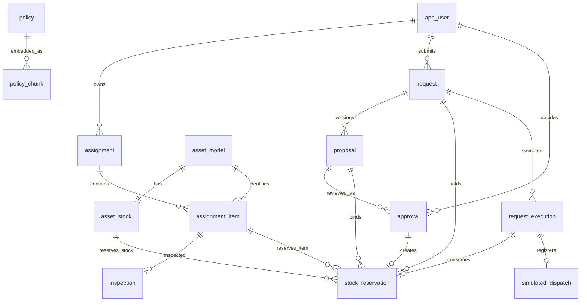
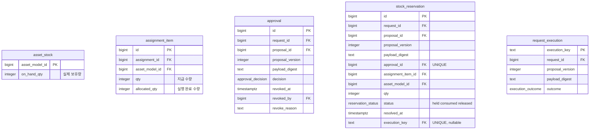
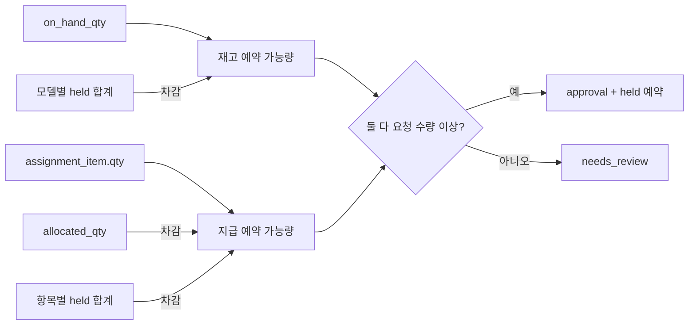
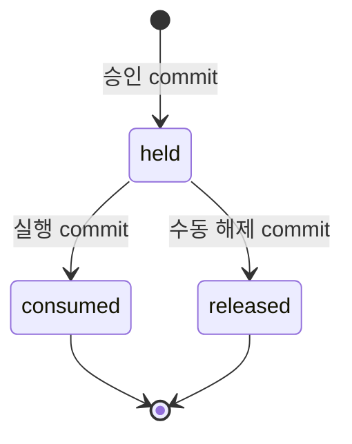
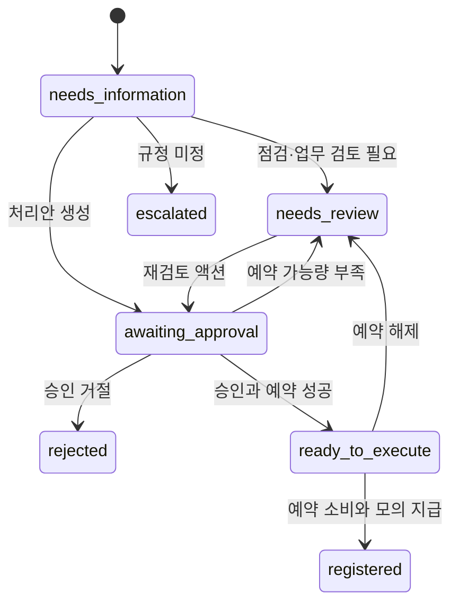

# AssetFlow 현재 ERD와 상태도

[SCHEMA.md](SCHEMA.md)의 구현 구조를 시각화한 문서다. 실제 제약은 Alembic
마이그레이션을 따른다.

## 업무 ERD

## 핵심 테이블

## 수량 관계

## 예약 상태

`consumed`와 `released`는 최종 상태다. 재승인하면 과거 행을 재사용하지 않고 새 승인과
새 예약을 만든다.

## 요청 상태

## 무결성 경계

- CHECK: 음수 보유량, 배분 초과, 잘못된 예약 상태 조합과 철회 필드 조합을 거부한다.
- 부분 UNIQUE 인덱스: 요청당 활성 승인 하나와 살아 있는 예약 하나를 보장한다.
- 복합 FK: 예약이 같은 요청·처리안·버전·digest의 승인과 실행만 참조하게 한다.
- 행 잠금: 여러 트랜잭션이 같은 항목과 재고의 예약 가능량을 동시에 소비하지 못하게 한다.
- 멱등 실행 키: 같은 의도의 재시도가 두 번째 지급을 만들지 못하게 한다.
