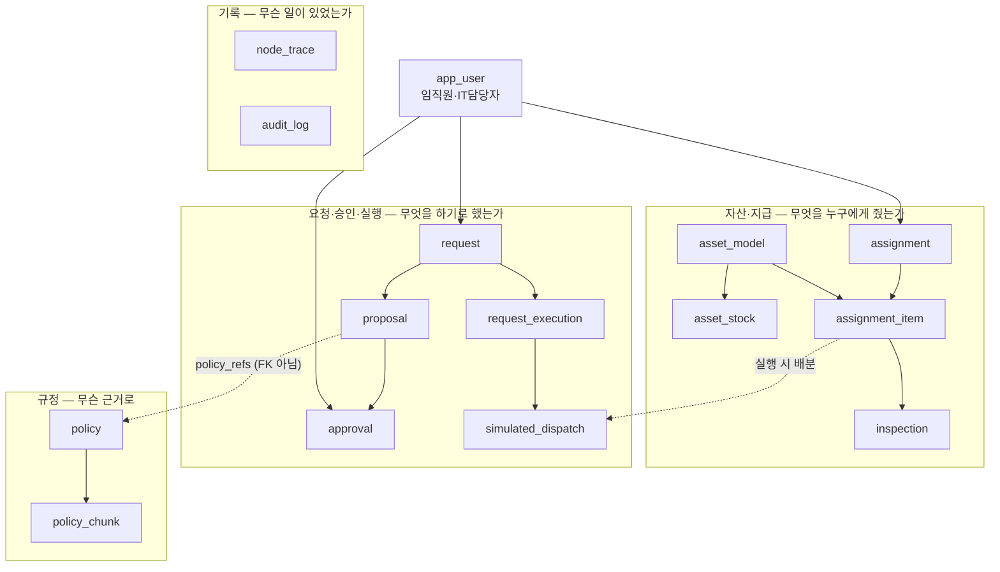
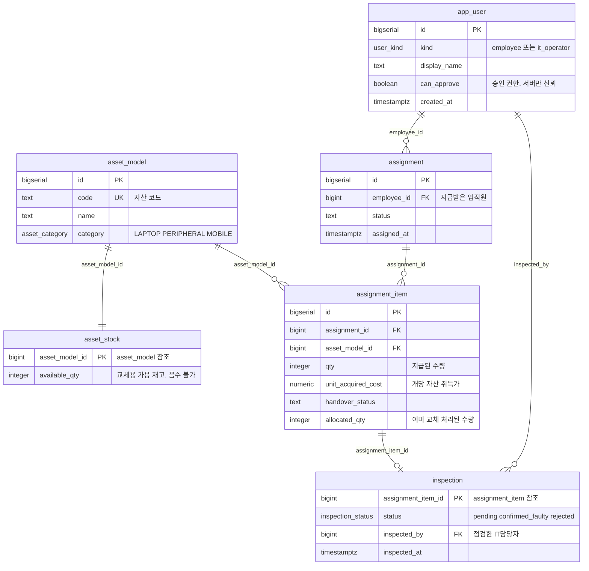
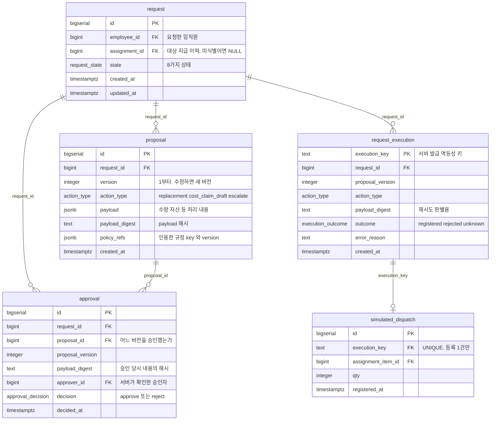
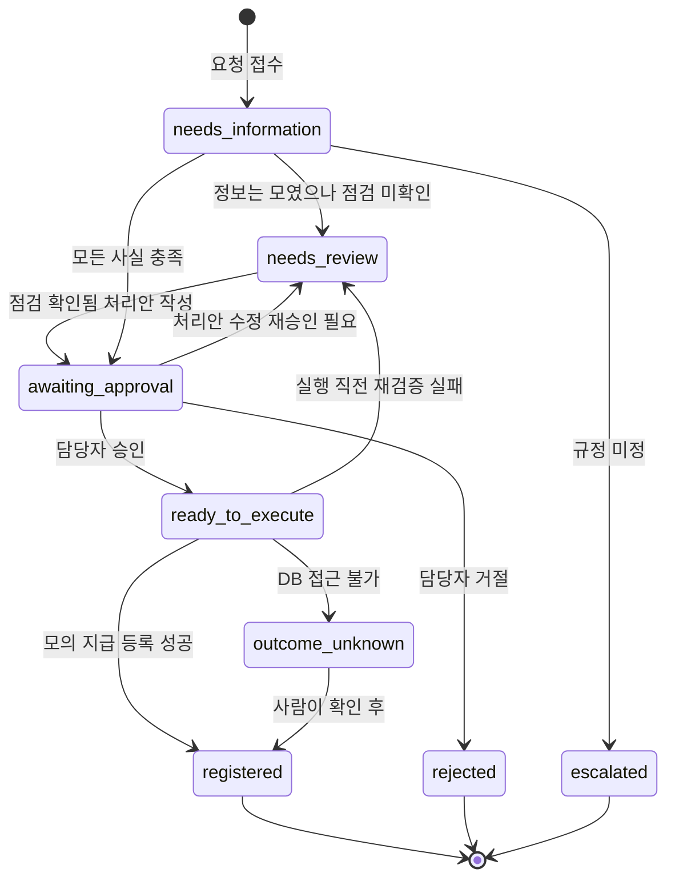
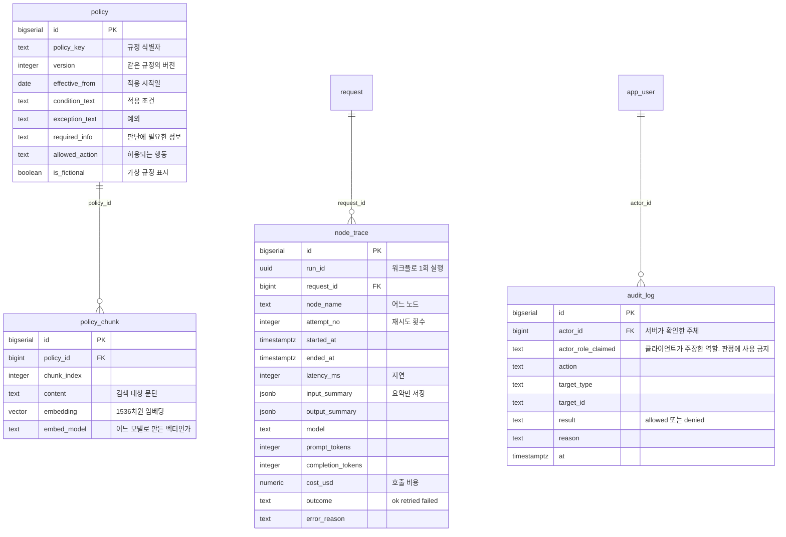
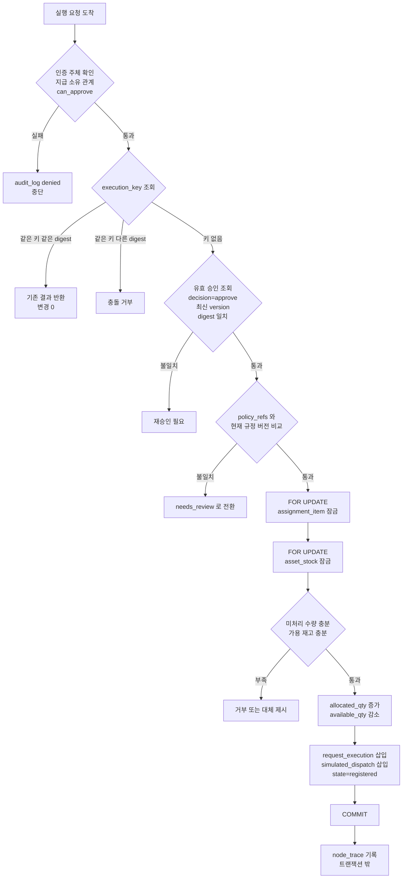

# AssetFlow 스키마 다이어그램과 용어 사전

[SCHEMA.md](SCHEMA.md)의 DDL을 그림과 한국어 설명으로 옮긴 문서다. DDL이 단일 출처이며, 둘이 다르면 SCHEMA.md를 따른다.

읽는 순서: 전체 개요 → 영역별 상세 → 제약 목록 → 실행 흐름.

---

## 1. 전체 개요

테이블 15개는 네 영역으로 나뉜다. 여기에 Alembic이 관리하는 `alembic_version` 한 개가 더 있다(업무 테이블이 아니다).



| 영역 | 질문 | 테이블 |
|---|---|---|
| 자산·지급 | 어떤 자산이 있고 누구에게 몇 개 줬는가 | `asset_model`, `asset_stock`, `assignment`, `assignment_item`, `inspection` |
| 요청·승인·실행 | 무엇을 하기로 했고 누가 승인했고 실제로 실행됐는가 | `request`, `proposal`, `approval`, `request_execution`, `simulated_dispatch` |
| 규정 | 그 판단의 근거는 무엇인가 | `policy`, `policy_chunk` |
| 기록 | 어떤 노드가 얼마나 걸렸고 누가 무엇을 거부당했는가 | `node_trace`, `audit_log` |
| 주체 | 누가 | `app_user` |

---

## 2. 자산·지급 영역



**가장 중요한 계산**

```
미처리 수량 = assignment_item.qty - assignment_item.allocated_qty
```

독 2개를 지급받아 1개를 이미 교체했다면 `qty=2, allocated_qty=1`이고 미처리는 1개다. 이 숫자가 "더 교체해줄 수 있는가"를 결정한다.

`inspection.status`가 `confirmed_faulty`여야 교체 처리안을 만들 수 있다. 요청자가 "고장났다"고 말한 것만으로는 `pending`이며, 이때 요청은 `needs_review`로 간다 (AR-03).

---

## 3. 요청·승인·실행 영역



**세 개의 다른 신원을 구분하는 것이 이 영역의 전부다**

| | 무엇을 식별하나 | 왜 필요한가 |
|---|---|---|
| `request.id` | 고객 사례 하나 | 대화가 여러 번 오가도 같은 사례 |
| `proposal.version` | 승인 대상이 된 **의도** | 수량이 바뀌면 다른 의도이므로 재승인 필요 |
| `execution_key` | 실행 **시도** | 같은 키 재시도는 안전, 새 키는 새 실행 |

`execution_key`는 `request_id` + `proposal_version` + `action_type`에서 서버가 만든다. 그래서 같은 의도에는 항상 같은 키가 나오고, 클라이언트가 새 키를 만들어 우회할 수 없다.

`payload_digest`가 두 곳(`approval`, `request_execution`)에 있는 이유가 다르다. `approval`의 것은 **승인 당시 내용과 실행 시점 내용이 같은지** 확인용이고, `request_execution`의 것은 **같은 키로 다른 내용이 왔는지** 판별용이다.

### request.state 8가지



`outcome_unknown`이 정식 상태인 이유: 성공인지 실패인지 **모를 때** 아무 쪽으로도 단정하지 않고 사람이 확인할 큐에 남기기 위해서다 (SYS-16).

---

## 4. 규정·기록 영역



`policy`와 `proposal.policy_refs`는 **외래키가 아니다.** 처리안은 인용한 규정의 `policy_key`와 `version`을 jsonb로 들고 있고, 실행 직전에 현재 규정 버전과 비교한다. 버전이 바뀌었으면 자동 실행하지 않고 재검토한다 (SYS-15).

`policy_chunk.embed_model`을 저장하는 이유: 임베딩 모델을 바꾸면 벡터를 전부 재생성해야 하므로, 평가 결과가 어떤 인덱스에서 나왔는지 기록에 남아야 한다.

`node_trace`는 업무 트랜잭션과 **분리해서** 기록한다. 관측 기록이 실패해도 업무 실행을 롤백시키지 않고, 반대로 트레이스를 업무 성공의 증거로도 쓰지 않는다.

`audit_log.actor_role_claimed`는 위조 시도를 남기기 위한 필드다. 권한 판정은 `app_user.can_approve`만 본다 (SYS-17b).

---

## 5. 안전장치 목록 — 무엇이 무엇을 막는가

세 가지 도구가 **각자 다른 구멍**을 막는다. 하나로 나머지를 대신할 수 없다.

| 도구 | 무엇을 보는가 | 무엇을 못 보는가 |
|---|---|---|
| CHECK 제약 | 지금 쓰려는 **값** | 문장과 문장 **사이**에 끼어든 다른 트랜잭션 |
| 멱등성 키 (`execution_key`) | 같은 요청의 **실행 횟수** | 서로 다른 요청들의 **총량** |
| 행 잠금 + 잠금 순서 | 읽기부터 쓰기까지의 **구간** | 값 자체의 유효성 |

### 제약 전체 목록

2026-09-15 마이그레이션 적용 후 DB에서 실측한 수치: CHECK 11개, UNIQUE 제약 6개, 부분 UNIQUE 인덱스 1개, PRIMARY KEY 16개, FOREIGN KEY 18개, ENUM 타입 7개. 아래 표는 그중 업무 규칙을 담은 것만 골라 정리한 것이다.

| 제약 | 테이블 | 막는 것 | SYS |
|---|---|---|---|
| `employee_cannot_approve` | `app_user` | 임직원에게 승인 권한이 붙는 것 | SYS-17b |
| `stock_not_negative` | `asset_stock` | 음수 재고 | SYS-09 |
| `qty_positive` | `assignment_item` | 0개 이하 지급 | — |
| `cost_not_negative` | `assignment_item` | 음수 취득가 | — |
| `allocation_within_qty` | `assignment_item` | 총 배분이 지급 수량 초과 | SYS-05a |
| `confirmed_requires_inspector` | `inspection` | 점검자 없는 점검 완료 | AR-03 |
| `UNIQUE (policy_key, version)` | `policy` | 같은 규정 같은 버전 중복 | SYS-15 |
| `UNIQUE (request_id, version)` | `proposal` | 같은 사례 같은 버전 중복 | SYS-02 |
| `one_active_approval_per_proposal` | `approval` | 한 처리안에 승인 2건 | SYS-02, SYS-13 |
| `execution_key` PK | `request_execution` | 같은 키 중복 실행 | SYS-03 |
| `UNIQUE (request_id, proposal_version, action_type)` | `request_execution` | 같은 의도 중복 실행 | SYS-03 |
| `minimum_scope_blocks_cost_claim_execution` | `request_execution` | 최소판에서 비용 청구 실행 | SYS-05b |
| `execution_key` UNIQUE | `simulated_dispatch` | 등록 2건 | SYS-03 |
| `trace_outcome_values`, `trace_attempt_positive` | `node_trace` | 잘못된 관측 값 | SYS-18 |
| `result_values` | `audit_log` | 잘못된 감사 결과값 | SYS-07, SYS-17 |

### CHECK로는 절대 막을 수 없는 것

```
allocated_qty = 1  인데  simulated_dispatch 행이 2건
```

`1 <= 2`이므로 CHECK는 **만족**한다. DB는 오류를 내지 않는다. 그런데 미처리 수량이 1로 잘못 계산되어 세 번째 배분이 통과한다. 에러 없이 조용히 무너진다.

이걸 막는 것은 CHECK가 아니라 **행 잠금**이다. 읽는 시점부터 `FOR UPDATE`로 잠가서, 낡은 값으로 판단하고 쓰는 일이 없게 한다.

---

## 6. 실행 트랜잭션 흐름



잠금 순서는 **항상** `assignment_item` → `asset_stock`이다. 역순으로 잠그는 코드가 하나라도 있으면 두 요청이 서로를 기다리는 교착이 생긴다.

커밋 후 응답이 유실되면 같은 `execution_key`로 조회한다. 새 키로 두 번째 변경을 만들지 않는다. 커밋 전 오류는 전체 롤백되고 같은 키로 재시도할 수 있다. DB에 닿지 못하면 `outcome_unknown`을 유지한다.

---

## 7. 용어 대응 — 이전 도메인과의 매핑

2026-09-11 도메인 전환 이전 문서나 대화를 볼 때 참고한다.

| 이전 (HOME/LIVING 반품·교환) | 현재 (사내 IT 자산) |
|---|---|
| 고객 / 운영자 | 임직원 / IT 담당자 |
| `customer_order` / `order_item` | `assignment` / `assignment_item` |
| `product` / `product_stock` | `asset_model` / `asset_stock` |
| `evidence_review` (파손 증빙 검토) | `inspection` (장비 점검) |
| `claim` / `claim_execution` | `request` / `request_execution` |
| `simulated_receipt` (모의 접수) | `simulated_dispatch` (모의 지급 등록) |
| 환불 초안 | 비용 청구 초안 |
| CF-01~08 | AR-01~08 |
